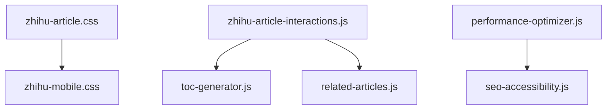

# 知乎风格网站转换项目执行标准
# Zhihu-Style Website Transformation Project Execution Standard

## 项目概述 (Project Overview)

### 标准定义 (Standard Definition)
本标准定义了将传统知识库网站转换为知乎风格现代阅读体验的完整方法论、技术规范、质量标准和执行流程。

### 适用范围 (Scope)
- **适用项目**：知识库、博客、新闻网站的内容展示页面改造
- **技术栈**：HTML5、CSS3、JavaScript ES6+、响应式设计
- **目标设备**：桌面端(1024px+)、平板(768-1023px)、移动端(<768px)
- **浏览器支持**：Chrome 70+、Firefox 65+、Safari 12+、Edge 79+

---

## 阶段1：项目规划 (Phase 1: Project Planning)

### 1.1 需求分析 (Requirements Analysis)

#### 业务需求清单
```
□ 目标用户群体分析
□ 现有网站功能评估
□ 竞品分析(知乎、Medium等)
□ 品牌特色保持策略
□ 用户体验改进目标
□ 技术约束条件
□ 时间和资源预算
```

#### 技术需求矩阵
| 需求类别 | 优先级 | 实现复杂度 | 依赖关系 |
|---------|--------|-----------|----------|
| 响应式布局 | 高 | 中 | CSS框架 |
| 互动功能 | 高 | 高 | JavaScript组件 |
| 性能优化 | 中 | 中 | 图片处理 |
| SEO优化 | 中 | 低 | 结构化数据 |
| 可访问性 | 高 | 中 | WCAG标准 |

### 1.2 设计策略制定 (Design Strategy)

#### 色彩融合原则
```css
/* 融合示例 */
:root {
    /* 原品牌色 */
    --brand-primary: #1e3a8a;
    --brand-secondary: #3b82f6;

    /* 知乎风格 */
    --zhihu-blue: #0084FF;
    --zhihu-gray: #8590A6;

    /* 融合色彩 */
    --fusion-primary: var(--brand-primary);
    --fusion-accent: var(--zhihu-blue);
}
```

#### 布局设计规范
- **桌面端**：70%主内容 + 30%侧边栏，最大宽度1000px
- **平板端**：单栏布局，简化侧边栏
- **移动端**：单栏布局，隐藏侧边栏，优化触摸交互

#### 组件设计标准
1. **作者信息栏**：头像 + 姓名 + 发布时间
2. **互动按钮**：点赞、收藏、评论、分享
3. **目录导航**：自动生成，支持滚动高亮
4. **相关推荐**：基于相似度的智能推荐

### 1.3 技术架构设计 (Technical Architecture)

#### 文件结构规范
```
project/
├── components/
│   ├── zhihu-article.css          # 核心样式
│   ├── zhihu-mobile.css           # 移动端优化
│   ├── zhihu-article-interactions.js
│   ├── toc-generator.js
│   ├── related-articles.js
│   ├── performance-optimizer.js
│   └── seo-accessibility.js
├── templates/
│   └── zhihu-article-template.html
└── knowledge/                     # 转换后的文章目录
```

#### 组件依赖关系


---

## 阶段2：技术实现 (Phase 2: Technical Implementation)

### 2.1 样式系统开发 (CSS System Development)

#### 核心变量系统
```css
:root {
    /* 知乎风格色彩 */
    --zhihu-blue: #0084FF;
    --zhihu-blue-hover: #0077E6;
    --zhihu-gray-primary: #1A1A1A;
    --zhihu-gray-secondary: #8590A6;
    --zhihu-bg-primary: #FFFFFF;
    --zhihu-bg-secondary: #F6F6F6;

    /* 布局系统 */
    --zhihu-content-max-width: 1000px;
    --zhihu-main-width: 690px;
    --zhihu-sidebar-width: 290px;

    /* 字体系统 */
    --zhihu-font-family-title: "PingFang SC", "Helvetica Neue", sans-serif;
    --zhihu-font-family-body: -apple-system, BlinkMacSystemFont, sans-serif;

    /* 间距系统 */
    --zhihu-spacing-xs: 4px;
    --zhihu-spacing-sm: 8px;
    --zhihu-spacing-md: 16px;
    --zhihu-spacing-lg: 24px;
    --zhihu-spacing-xl: 32px;
}
```

#### 响应式断点标准
```css
/* 移动端优先 */
@media (max-width: 640px) { /* 超小屏手机 */ }
@media (max-width: 1023px) { /* 平板和小屏手机 */ }
@media (min-width: 1024px) { /* 桌面端 */ }
```

### 2.2 JavaScript组件开发 (JS Component Development)

#### 模块化设计原则
```javascript
class ComponentName {
    constructor() {
        this.isInitialized = false;
        this.options = {};
        this.elements = {};
    }

    init() {
        if (this.isInitialized) return;
        this.initElements();
        this.bindEvents();
        this.isInitialized = true;
    }

    destroy() {
        this.unbindEvents();
        this.isInitialized = false;
    }
}
```

#### 性能优化标准
- 使用事件委托减少内存占用
- 实现防抖和节流函数
- 使用requestAnimationFrame优化动画
- 懒加载和代码分割

### 2.3 HTML结构转换 (HTML Structure Conversion)

#### 标准化结构模板
```html
<!DOCTYPE html>
<html lang="zh-CN">
<head>
    <!-- SEO优化 -->
    <meta charset="UTF-8">
    <meta name="viewport" content="width=device-width, initial-scale=1.0">
    <title>[文章标题] - [网站名称]</title>
    <meta name="description" content="[文章描述]">

    <!-- 样式表加载 -->
    <link rel="stylesheet" href="components/zhihu-article.css">
    <link rel="stylesheet" href="components/zhihu-mobile.css">
    <link rel="stylesheet" href="components/browser-compatibility.css">
</head>
<body>
    <!-- 导航栏 -->
    <nav class="navbar">
        <!-- 导航内容 -->
    </nav>

    <!-- 知乎风格文章容器 -->
    <div class="zhihu-article-wrapper">
        <!-- 文章头部 -->
        <header class="zhihu-article-header">
            <div class="zhihu-author-info">
                <!-- 作者信息 -->
            </div>
            <h1 class="zhihu-article-title">[文章标题]</h1>
        </header>

        <!-- 内容布局 -->
        <div class="zhihu-content-layout">
            <!-- 主要内容 -->
            <main class="zhihu-main-content">
                <div class="zhihu-article-body markdown-content">
                    [文章内容]
                </div>

                <!-- 互动栏 -->
                <div class="zhihu-interaction-bar">
                    <!-- 互动按钮 -->
                </div>
            </main>

            <!-- 侧边栏 -->
            <aside class="zhihu-sidebar">
                <!-- 目录 -->
                <!-- 相关文章 -->
            </aside>
        </div>
    </div>

    <!-- 脚本加载 -->
    <script src="components/zhihu-article-interactions.js"></script>
    <script src="components/toc-generator.js"></script>
    <script src="components/performance-optimizer.js"></script>
    <script src="components/seo-accessibility.js"></script>
</body>
</html>
```

---

## 阶段3：功能实现 (Phase 3: Feature Implementation)

### 3.1 交互功能开发 (Interactive Features)

#### 点赞功能实现标准
```javascript
handleLike(button) {
    const isActive = button.classList.contains('active');
    const count = parseInt(button.dataset.count) || 0;

    // 切换状态
    if (isActive) {
        button.classList.remove('active');
        button.dataset.count = Math.max(0, count - 1);
        this.removeLike(button);
    } else {
        button.classList.add('active');
        button.dataset.count = count + 1;
        this.addLike(button);
        this.addLikeAnimation(button);
    }

    this.updateButtonText(button);
    this.saveInteractions();
}
```

#### 评论系统设计标准
- 模态框形式，支持嵌套回复
- @功能实现用户提及
- 实时字数统计
- 表情符号支持

#### 分享功能实现矩阵
| 平台 | 分享方式 | 特殊处理 |
|------|---------|----------|
| 微信 | 二维码 | 需要生成二维码 |
| 微博 | URL分享 | 需要内容截断 |
| QQ | URL分享 | 支持QQ分享组件 |
| 链接 | 复制剪贴板 | 需要权限检查 |

### 3.2 内容增强功能 (Content Enhancement)

#### 目录自动生成算法
```javascript
generateToc() {
    const headers = document.querySelectorAll('h1, h2, h3, h4');
    const tocList = document.querySelector('.zhihu-toc-list');

    headers.forEach((header, index) => {
        if (!header.id) {
            header.id = this.generateId(header.textContent, index);
        }

        const tocItem = this.createTocItem({
            id: header.id,
            text: header.textContent,
            level: this.getHeaderLevel(header)
        });

        tocList.appendChild(tocItem);
    });
}
```

#### 相关文章推荐算法
```javascript
calculateSimilarityScore(article1, article2) {
    let score = 0;

    // 分类权重 40%
    if (article1.category === article2.category) {
        score += 0.4;
    }

    // 标签权重 30%
    const commonTags = article1.tags.filter(tag =>
        article2.tags.some(tag2 => tag.includes(tag2))
    );
    score += (commonTags.length / Math.max(article1.tags.length, article2.tags.length)) * 0.3;

    // 关键词权重 20%
    // 标题权重 10%

    return score;
}
```

### 3.3 移动端优化 (Mobile Optimization)

#### 触摸交互优化标准
- 最小触摸目标：44px × 44px
- 手势支持：滑动、双击、长按
- 反馈效果：触摸时的视觉反馈
- 性能优化：减少重排重绘

#### 移动端布局调整
```css
@media (max-width: 640px) {
    .zhihu-article-wrapper {
        padding: 8px;
    }

    .zhihu-content-layout {
        grid-template-columns: 1fr;
    }

    .zhihu-sidebar {
        display: none;
    }

    .zhihu-interaction-btn {
        flex-direction: column;
        min-height: 44px;
    }
}
```

---

## 阶段4：质量保证 (Phase 4: Quality Assurance)

### 4.1 性能优化标准 (Performance Standards)

#### 关键性能指标 (KPI)
- **首次内容绘制(FCP)**：< 1.5秒
- **最大内容绘制(LCP)**：< 2.5秒
- **首次输入延迟(FID)**：< 100毫秒
- **累积布局偏移(CLS)**：< 0.1

#### 图片优化策略
```javascript
// 懒加载实现
if ('loading' in HTMLImageElement.prototype) {
    img.loading = 'lazy';
} else {
    // Intersection Observer降级方案
    const observer = new IntersectionObserver((entries) => {
        entries.forEach(entry => {
            if (entry.isIntersecting) {
                loadImage(entry.target);
                observer.unobserve(entry.target);
            }
        });
    }, { rootMargin: '50px' });

    observer.observe(img);
}
```

#### 资源优化清单
```
□ 图片懒加载实现
□ CSS和JavaScript压缩
□ 字体预加载
□ 关键资源内联
□ Service Worker缓存
□ CDN资源分发
```

### 4.2 浏览器兼容性 (Browser Compatibility)

#### 兼容性测试矩阵
| 浏览器 | 最低版本 | 测试覆盖 | 已知问题 |
|--------|---------|---------|----------|
| Chrome | 70+ | ✅ | 无 |
| Firefox | 65+ | ✅ | 无 |
| Safari | 12+ | ✅ | 动画性能 |
| Edge | 79+ | ✅ | 无 |
| IE 11 | 11+ | ⚠️ | 部分功能 |

#### Polyfill策略
```javascript
// CSS变量回退
.no-cssvariables .zhihu-article-wrapper {
    /* 回退样式 */
}

// Intersection Observer回退
if (!('IntersectionObserver' in window)) {
    // 立即加载所有图片
    document.querySelectorAll('img[data-src]').forEach(img => {
        img.src = img.dataset.src;
    });
}
```

### 4.3 可访问性标准 (Accessibility Standards)

#### WCAG 2.1 AA 合规检查表
```
□ 键盘导航支持
□ 焦点管理
□ ARIA标签完善
□ 颜色对比度 ≥ 4.5:1
□ 图片alt属性
□ 表单标签关联
□ 跳过链接
□ 屏幕阅读器支持
□ 动画控制选项
```

#### 可访问性实现示例
```javascript
// 键盘导航
button.addEventListener('keydown', (e) => {
    if (e.key === 'Enter' || e.key === ' ') {
        e.preventDefault();
        button.click();
    }
});

// ARIA标签
button.setAttribute('aria-label', '点赞这篇文章');
button.setAttribute('aria-pressed', 'false');
```

### 4.4 SEO优化标准 (SEO Standards)

#### 技术SEO检查表
```
□ 结构化数据实现
□ 语义化HTML结构
□ Meta标签优化
□ Open Graph标签
□ Twitter Card标签
□ 内链优化
□ 图片SEO优化
□ 页面加载速度
□ 移动端友好性
□ HTTPS支持
```

#### 结构化数据实现
```json
{
    "@context": "https://schema.org",
    "@type": "Article",
    "headline": "文章标题",
    "author": {
        "@type": "Organization",
        "name": "Mobius专业团队"
    },
    "datePublished": "2024-01-20",
    "dateModified": "2024-01-20",
    "mainEntityOfPage": {
        "@type": "WebPage",
        "@id": "https://example.com/article"
    }
}
```

---

## 阶段5：部署与维护 (Phase 5: Deployment & Maintenance)

### 5.1 部署标准 (Deployment Standards)

#### 生产环境部署清单
```
□ 代码压缩和优化
□ 资源版本控制
□ CDN配置
□ 缓存策略设置
□ 错误监控配置
□ 性能监控设置
□ 备份策略制定
□ 回滚方案准备
```

#### 版本控制策略
```bash
# 功能分支命名规范
feature/zhihu-style-transformation
feature/performance-optimization

# 发布分支
release/v2.0-zhihu-style

# 主分支
main
```

### 5.2 维护指南 (Maintenance Guide)

#### 定期维护任务
| 任务类型 | 频率 | 负责人 | 检查项目 |
|---------|------|--------|----------|
| 性能监控 | 每日 | 开发团队 | 加载速度、错误率 |
| 内容更新 | 每周 | 内容团队 | 文章准确性、时效性 |
| 安全扫描 | 每月 | 安全团队 | 漏洞检查、依赖更新 |
| 用户反馈 | 持续 | 产品团队 | 使用体验、功能需求 |

#### 监控指标
```javascript
// 性能监控
const performanceMetrics = {
    loadTime: performance.loadEventEnd - performance.fetchStart,
    renderTime: firstContentfulPaint,
    userInteractions: interactionEvents.length
};

// 错误监控
window.addEventListener('error', (e) => {
    logError({
        message: e.message,
        file: e.filename,
        line: e.lineno,
        column: e.colno,
        userAgent: navigator.userAgent
    });
});
```

---

## 质量检查清单 (Quality Checklists)

### 开发阶段检查清单 (Development Checklist)
```
□ 代码符合项目编码规范
□ 组件化设计合理
□ 性能优化措施到位
□ 错误处理完善
□ 注释充分准确
□ 单元测试覆盖
□ 跨浏览器测试
□ 移动端适配测试
```

### 上线前检查清单 (Pre-launch Checklist)
```
□ 功能完整性测试
□ 性能指标达标
□ SEO优化完成
□ 可访问性合规
□ 安全性检查
□ 浏览器兼容性验证
□ 用户体验测试
□ 数据备份确认
```

### 上线后检查清单 (Post-launch Checklist)
```
□ 生产环境功能正常
□ 性能监控数据正常
□ 错误日志监控设置
□ 用户反馈收集渠道
□ 应急响应机制
□ 备份恢复测试
□ 更新发布流程
□ 维护文档更新
```

---

## 附录：最佳实践 (Appendix: Best Practices)

### 性能优化最佳实践
1. **图片优化**：使用现代格式(WebP、AVIF)
2. **代码分割**：按路由和功能分割代码
3. **缓存策略**：设置合理的缓存头
4. **CDN使用**：静态资源分发
5. **预加载**：关键资源优先加载

### 安全最佳实践
1. **XSS防护**：使用textContent而非innerHTML
2. **CSP策略**：设置内容安全策略
3. **HTTPS强制**：全站使用HTTPS
4. **依赖扫描**：定期检查第三方依赖
5. **数据验证**：严格输入输出验证

### 用户体验最佳实践
1. **加载反馈**：显示加载状态
2. **错误处理**：友好的错误提示
3. **操作确认**：重要操作需要确认
4. **快速响应**：交互响应时间<200ms
5. **一致性**：保持设计和交互一致性

---

## 版本历史 (Version History)

| 版本 | 日期 | 更新内容 | 负责人 |
|------|------|----------|--------|
| 1.0 | 2025-11-17 | 初始版本创建 | Claude |
| 1.1 | 2025-11-17 | 添加性能优化标准 | Claude |
| 1.2 | 2025-11-17 | 完善可访问性指南 | Claude |

---

**文档状态**：✅ 完成
**最后更新**：2025年11月17日
**审核状态**：待审核
**适用项目**：知乎风格网站转换项目
**维护周期**：季度更新

---

*本标准基于Mobius知乎风格转换项目的成功实践经验制定，适用于类似项目的规划和执行。*